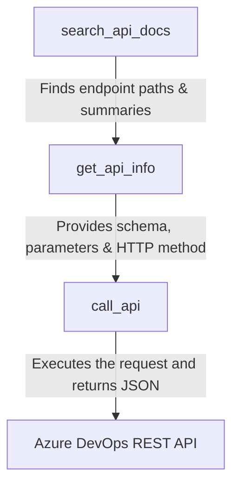

# Generic REST Client & API Directory

Azure DevOps has a massive API surface consisting of thousands of endpoints. While this MCP server exposes 20+ specialized tools for common operations (Git, Work Items, Pipelines, Identities), it also provides a **Generic REST Client** to invoke **any** Azure DevOps REST API endpoint.

> [!CAUTION]
> **CRITICAL WARNING: Destructive Actions via `call_api`**
> * Using the `call_api` tool with the `DELETE` method allows you to delete repositories, build definitions, pipelines, or work items permanently.
> * **Work items deleted via `call_api` (with the DELETE method) do NOT go to a Recycle Bin or Trashcan.** They are instantly and permanently destroyed from your Azure DevOps project. Use this tool with extreme care.

---

## 🛠️ The Toolkit: Three Interconnected Tools

To help you discover and call arbitrary endpoints, the server includes three tools:



1. **`search_api_docs`**: Performs high-speed offline searches over a local directory of 1,000+ REST API endpoints.
2. **`get_api_info`**: Retrieves full parameter schemas, request bodies, and Microsoft documentation links for a specific endpoint (falls back to fetching from Microsoft servers online if missing).
3. **`call_api`**: Makes the actual HTTP request (GET, POST, PUT, PATCH, DELETE) to the endpoint.

---

## 🔍 Step 1: Searching for an Endpoint

Suppose you want to find how to manage repository branches (known as "Refs" in Git). Run `search_api_docs`:

* **Parameters**: `query: "refs", area: "git"`
* **Output**:
  ```json
  [
    {
      "method": "GET",
      "path": "/_apis/git/repositories/{repositoryId}/refs",
      "summary": "Queries the refs (branches, tags, etc.) in a Git repository."
    },
    {
      "method": "POST",
      "path": "/_apis/git/repositories/{repositoryId}/refs",
      "summary": "Creates, updates, or deletes refs (branches, tags, lock state, etc.) in a Git repository."
    }
  ]
  ```

---

## 📖 Step 2: Retrieving API Schema details

Once you have the path, inspect its parameters and body using `get_api_info`:

* **Parameters**: `method: "GET", path: "/_apis/git/repositories/{repositoryId}/refs"`
* **Output**:
  ```json
  {
    "path": "/_apis/git/repositories/{repositoryId}/refs",
    "method": "GET",
    "description": "Queries the refs in a Git repository.",
    "parameters": {
      "repositoryId": { "type": "string", "required": true, "description": "The name or ID of the repository" },
      "filter": { "type": "string", "required": false, "description": "Filter by prefix (e.g. 'heads/')" }
    }
  }
  ```

---

## 🚀 Step 3: Executing the API Call

Now you can invoke `call_api` to list all branches in a repository:

* **Parameters**:
  * `method`: `"GET"`
  * `path`: `"/_apis/git/repositories/MyRepo/refs"`
  * `body`: `{}`
  * `apiVersion`: `"7.1"`
* **Output**: Returns a JSON list of all matching references (e.g., `refs/heads/main`, `refs/heads/dev`).

---

## ⚠️ High-Risk Examples (Deletions)

If you must delete a resource, double-check that you are targeting the correct resource ID before calling.

### Example: Permanently Deleting a Work Item (No Trashcan!)
To permanently delete work item with ID `999`:
* **Tool**: `call_api`
* **Parameters**:
  * `method`: `"DELETE"`
  * `path`: `"/_apis/wit/workitems/999"`
  * `apiVersion`: `"7.1"`
* **Impact**: Work Item `999` is deleted instantly. It **will not** appear in the recycle bin and cannot be restored.

---
## Quick Navigation Sidebar
* [Home](Home)
* [Configuration & Setup](Configuration-and-Setup)
* [Tools Reference](Tools-Reference)
* [Generic REST Client & API Directory](Generic-REST-Client)
* [Testing & Sandbox Setup](Testing-and-Sandbox)
